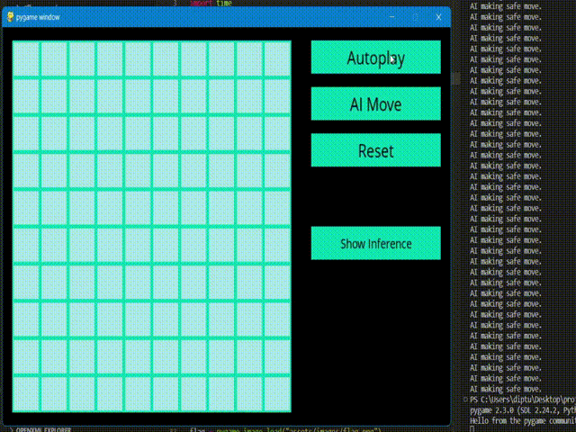
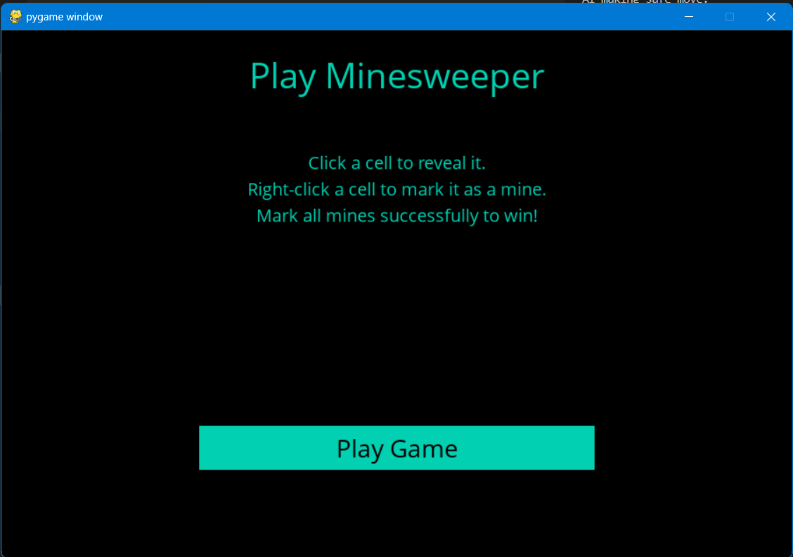
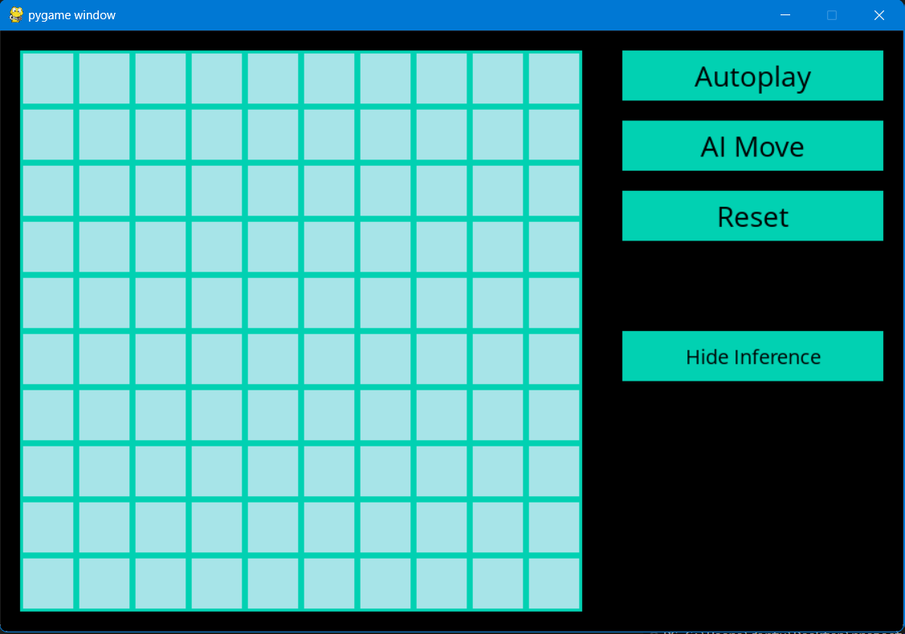
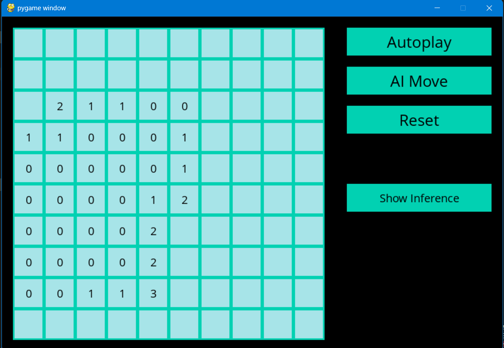
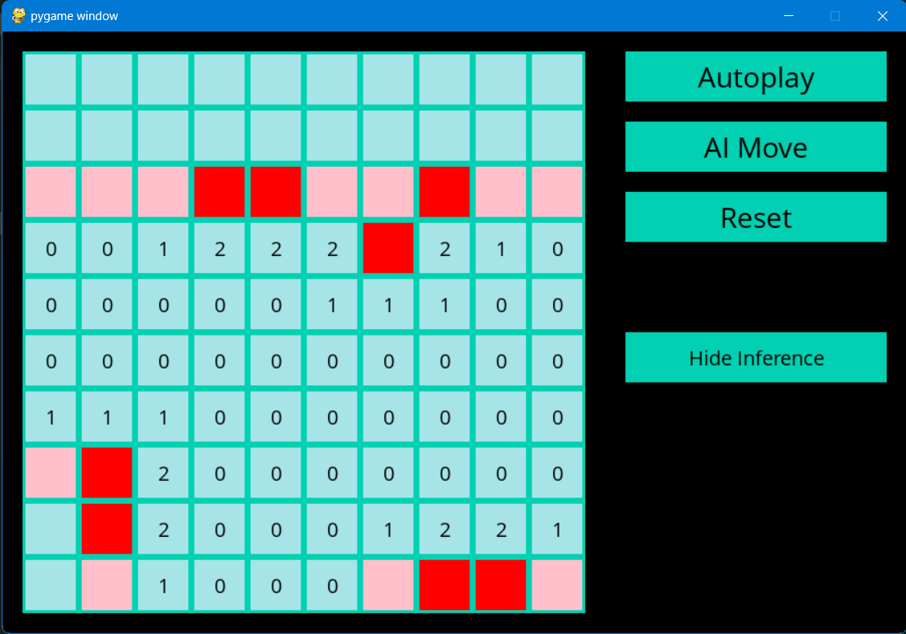

# Minesweeper AI

Minesweeper AI is an implementation of the classic Minesweeper game, featuring a built-in AI agent to assist or automatically play the game. The game is built using Python and Pygame.

## Screenshots

### Autoplay with Inference Shown (GIF - 25 seconds)

### Main Menu

### Start Screen

### Gameplay with Inference Hidden

### Gameplay with Inference Shown

## Features

- Classic Minesweeper gameplay with adjustable board dimensions and mine count
- AI agent to assist with gameplay or autoplay
- Autoplay speed control
- Option to show or hide AI's inference on safe and mine cells
- Attractive and responsive user interface

## Installation

1. Install Python 3.7 or later from [https://www.python.org/downloads/](https://www.python.org/downloads/)
2. Clone this repository or download and extract the ZIP file
3. Install the required dependencies: `pip install pygame`
4. Run the game: `python Runner.py`

## How to Play

- Left-click on a cell to reveal it
- Right-click on a cell to flag it as a mine
- Use the buttons on the right side to control AI and game settings
- Win the game by flagging all mines correctly

## AI Features

- The AI agent can make safe moves and random moves based on its knowledge
- The agent can mark cells as safe or as mines, and updates its knowledge accordingly
- The agent can infer new knowledge from existing knowledge, improving its performance
- Autoplay mode allows the AI agent to play the game automatically with adjustable speed

## Contributing

Contributions are welcome! Feel free to submit a pull request or open an issue to discuss potential changes or improvements.

## License

This project is licensed under the MIT License - see the [LICENSE](LICENSE) file for details.